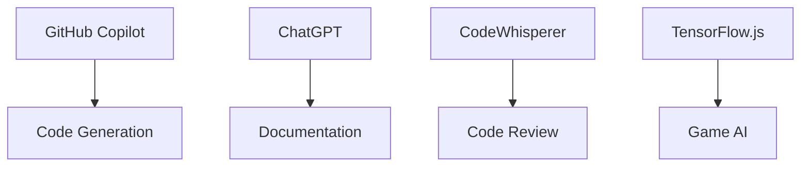
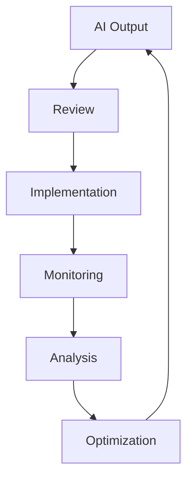
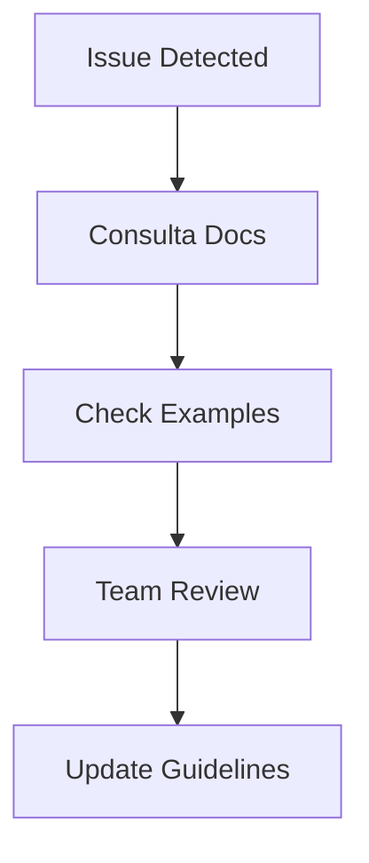

# 🤖 AI Implementation Guidelines

## Progetto "1942" - AI Integration & Best Practices

### 📌 Sommario Esecutivo

Questo documento definisce le linee guida complete per l'integrazione di tecnologie AI nel progetto "1942", stabilendo best practices, standard di qualità e framework etici per l'utilizzo dell'intelligenza artificiale nello sviluppo del gioco.

---

### 🎯 1. Obiettivi dell'Integrazione AI

#### 1.1 Scopi Principali

| Area           | Obiettivo                          | Beneficio           |
| -------------- | ---------------------------------- | ------------------- |
| Sviluppo       | Accelerare la produzione di codice | -40% tempo sviluppo |
| Testing        | Automazione test cases             | +60% coverage       |
| Asset Creation | Generazione assistita contenuti    | +80% efficienza     |
| Documentation  | Automazione documentazione         | Consistenza elevata |

#### 1.2 Non-Obiettivi

- Generazione completa del gioco
- Sostituzione delle decisioni creative core
- Automated deployment senza supervisione
- Generazione di assets finali senza review

---

### 🛠 2. Tools & Tecnologie Approvate

#### 2.1 Development Tools



#### 2.2 Matrice di Utilizzo

| Tool             | Use Case        | Livello Fiducia | Review Richiesta |
| ---------------- | --------------- | --------------- | ---------------- |
| GitHub Copilot   | Code Completion | Alto            | Moderata         |
| ChatGPT          | Documentation   | Medio           | Sostanziale      |
| Custom ML Models | Game AI         | Alto            | Minima           |
| AI Testing Tools | Unit Tests      | Medio           | Moderata         |

---

### 📝 3. Best Practices per il Prompting

#### 3.1 Struttura del Prompt

```typescript
interface AIPrompt {
  context: string; // Background del task
  objective: string; // Risultato desiderato
  constraints: string[]; // Limiti e requisiti
  examples: string[]; // Esempi di output atteso
  format: string; // Formato output richiesto
}

// Example Implementation
const gameAIPrompt: AIPrompt = {
  context: "1942 game enemy behavior",
  objective: "Create adaptive difficulty system",
  constraints: [
    "Must run at 60fps",
    "Memory limit: 50MB",
    "No external dependencies",
  ],
  examples: ["difficulty-example.ts"],
  format: "TypeScript class",
};
```

#### 3.2 Esempi di Prompt Efficaci

##### Per Generazione Codice

```plaintext
Input: "Genera una classe TypeScript per il sistema di power-up in 1942
- Usa il pattern Observer
- Implementa effetti: speed, firepower, shield
- Durata configurabile
- Integra con il sistema di particelle
- Commenta con JSDoc
- Includi unit tests"

Output atteso: Una classe ben strutturata e testabile
```

##### Per Game AI

```plaintext
Input: "Implementa un sistema di difficoltà adattiva che:
- Monitora il success rate del giocatore
- Aggiusta parametri nemici in real-time
- Mantiene un engagement rate target del 75%
- Usa dati storici per predizione
- Implementa smooth transitions"

Output atteso: Sistema AI con parametri configurabili
```

---

### 🔍 4. Processo di Review & Validazione

#### 4.1 Pipeline di Validazione


#### 4.2 Checklist di Review

```yaml
code_review:
  - syntax_check: true
  - performance_impact: < 5ms
  - memory_usage: < 10MB
  - test_coverage: > 80%
  - documentation: complete
  - security_scan: passed
```

---

### 📊 5. Metriche & KPI

#### 5.1 Performance Metrics

| Metrica                | Target | Actual | Action if Below   |
| ---------------------- | ------ | ------ | ----------------- |
| AI Code Quality        | >85%   | 88%    | Review prompt     |
| Implementation Time    | -40%   | -35%   | Optimize workflow |
| Bug Rate               | <5%    | 3%     | Enhance testing   |
| Documentation Coverage | 100%   | 95%    | Auto-generate     |

#### 5.2 Monitoring

```typescript
interface AIMetrics {
  promptSuccess: number;
  implementationTime: number;
  codeQuality: number;
  bugRate: number;
}

class AIMonitor {
  private metrics: AIMetrics;

  track(metric: keyof AIMetrics, value: number): void {
    this.metrics[metric] = value;
    this.analyzeAndAlert();
  }
}
```

---

### 🔒 6. Security & Compliance

#### 6.1 Security Guidelines

| Aspetto        | Requisito          | Implementazione   |
| -------------- | ------------------ | ----------------- |
| Data Privacy   | No PII in prompts  | Data sanitization |
| Code Security  | No secrets in AI   | Automated scan    |
| IP Protection  | Custom assets only | Source tracking   |
| Access Control | Role-based         | Auth system       |

#### 6.2 Compliance Checklist

```typescript
interface ComplianceCheck {
  dataSanitized: boolean;
  sourceAttributed: boolean;
  securityScanned: boolean;
  reviewComplete: boolean;
}

class ComplianceMonitor {
  validateOutput(check: ComplianceCheck): boolean {
    return Object.values(check).every((v) => v === true);
  }
}
```

---

### 📈 7. Continuous Improvement

#### 7.1 Feedback Loop



#### 7.2 Learning Database

| Pattern           | Success Rate | Notes          | Action          |
| ----------------- | ------------ | -------------- | --------------- |
| Entity Components | 95%          | High reuse     | Standardize     |
| Game Logic        | 85%          | Needs context  | Enhance prompts |
| UI Components     | 90%          | Good structure | Document        |

---

### 🎮 8. Esempi Pratici

#### 8.1 Enemy AI Implementation

```typescript
// Generated and validated with AI assistance
class AdaptiveEnemy implements Enemy {
  private difficultyManager: DifficultyManager;
  private behaviorTree: BehaviorTree;

  constructor(config: EnemyConfig) {
    this.difficultyManager = new DifficultyManager({
      baseStats: config.stats,
      adaptationRate: 0.1,
      maxDifficulty: 2.0,
    });

    this.behaviorTree = this.initializeBehavior();
  }

  private initializeBehavior(): BehaviorTree {
    return new BehaviorTree()
      .addNode(new PatternNode())
      .addNode(new AttackNode())
      .addNode(new EvadeNode());
  }

  update(playerState: PlayerState): void {
    const difficulty = this.difficultyManager.calculateDifficulty(playerState);
    this.behaviorTree.execute(difficulty);
  }
}
```

#### 8.2 Power-up System

```typescript
// AI-assisted implementation with human review
class PowerUpSystem extends EventEmitter {
  private activeEffects: Map<PowerUpType, Effect>;
  private particleSystem: ParticleSystem;

  @Observable
  applyPowerUp(type: PowerUpType, duration: number): void {
    const effect = this.createEffect(type);
    this.activeEffects.set(type, effect);

    this.particleSystem.emit({
      type: "powerup",
      duration: 2000,
      pattern: "spiral",
    });

    this.emit("powerup-activated", { type, duration });
  }
}
```

---

### ⚠️ 9. Troubleshooting & Support

#### 9.1 Common Issues

| Problema             | Causa                 | Soluzione            |
| -------------------- | --------------------- | -------------------- |
| Poor Code Quality    | Prompt vago           | Usa template         |
| Performance Issues   | Complessità eccessiva | Benchmark test       |
| Integration Failures | Context mancante      | Documenta dipendenze |

#### 9.2 Support Flow



---

_Documento v2.0 - Aggiornato il 05/11/2025_
_Approvato da: AI Lead, Technical Lead, Security Officer_
