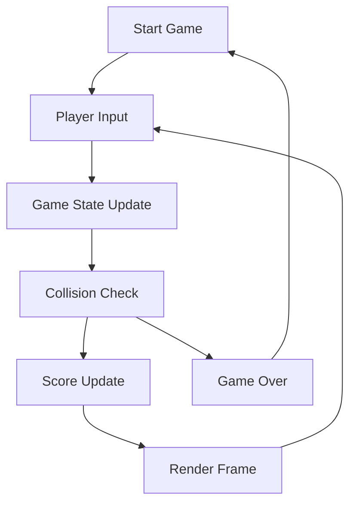
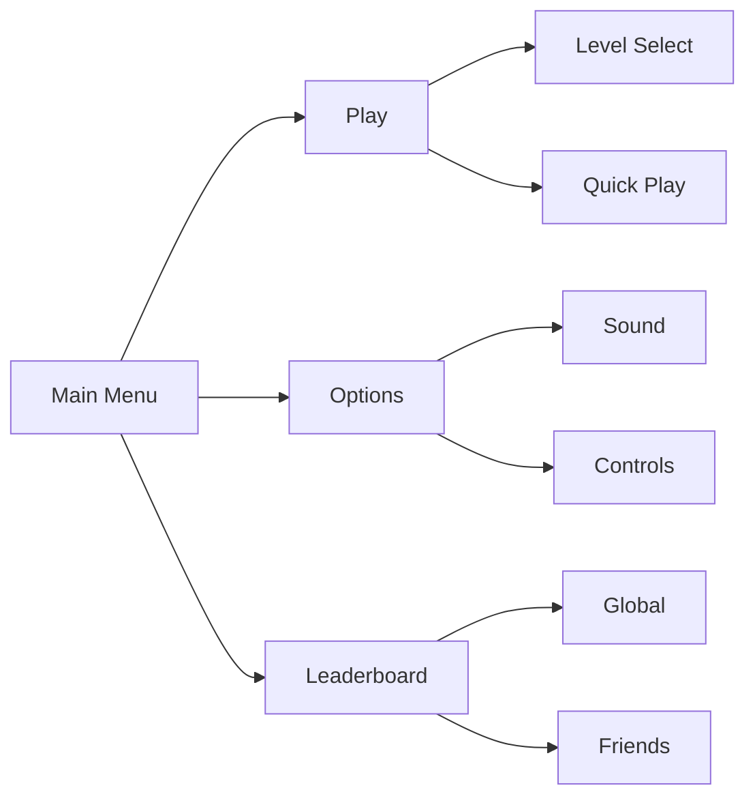
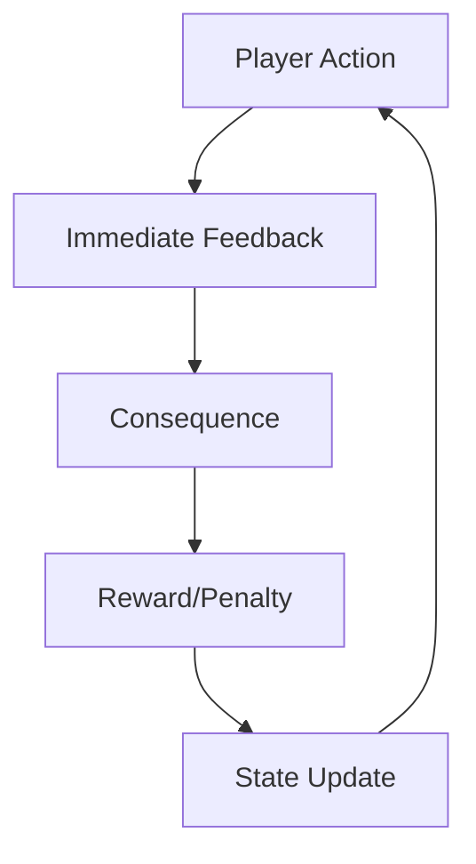

# 🎮 Analisi Funzionale

## Progetto "1942" - Game Design Document

### 📌 Sommario Esecutivo

Questo documento fornisce un'analisi dettagliata delle funzionalità e meccaniche di gioco del progetto "1942", definendo l'esperienza utente completa e le interazioni chiave del sistema.

---

### 🎯 1. Overview del Sistema

#### 1.1 Core Loop



#### 1.2 Obiettivi Principali

1. **Sopravvivenza:** Evitare proiettili e nemici
2. **Punteggio:** Massimizzare score attraverso combo e precision
3. **Progressione:** Sbloccare power-up e livelli avanzati
4. **Competizione:** Scalare la leaderboard globale

---

### 🎲 2. Meccaniche di Gioco

#### 2.1 Sistema di Controllo

| Input            | Azione          | Feedback         |
| ---------------- | --------------- | ---------------- |
| Arrow Keys/Swipe | Movimento aereo | Trail visivo     |
| Space/Tap        | Sparo           | Flash + Sound FX |
| Esc/Double Tap   | Pausa           | Blur + Menu      |
| Shift/Hold       | Focus Mode      | Rallentamento    |

#### 2.2 Sistema di Combattimento

| Elemento              | Comportamento        | Reward            |
| --------------------- | -------------------- | ----------------- |
| Proiettile Base       | Movimento lineare    | 100 pts           |
| Proiettile Potenziato | Pattern a ventaglio  | 300 pts           |
| Combo Shot            | Chain di 3+ colpi    | Bonus x1.5        |
| Perfect Dodge         | Schivata ravvicinata | Shield temporaneo |

---

### 👤 3. User Stories & Casi d'Uso

#### 3.1 Giocatore Casual

```gherkin
Feature: Quick Play Session
  As a casual player
  I want to jump into a quick game session
  So that I can enjoy the game in brevi pause

  Scenario: Partita Veloce
    Given I am on the main menu
    When I press "Quick Play"
    Then I should start at level 1
    And I should see the basic controls tutorial
    And I should have 3 lives
```

#### 3.2 Giocatore Competitivo

```gherkin
Feature: High Score Chase
  As a competitive player
  I want to optimize my score through advanced mechanics
  So that I can reach the top of the leaderboard

  Scenario: Perfect Run
    Given I am on a level
    When I achieve a 10x combo
    And I maintain full health
    Then I should receive a "Perfect" bonus
    And my score multiplier should increase
```

---

### 🎨 4. Interfaccia Utente

#### 4.1 HUD Elements

```
+------------------+
|Score: 000000     |
|Lives: ❤❤❤      |
|                  |
|     [PLAYER]     |
|                  |
|Combo: x3         |
|Power: ■■■□□     |
+------------------+
```

#### 4.2 Menu Flow



---

### 🎯 5. Progressione e Bilanciamento

#### 5.1 Curve di Difficoltà

```
Difficoltà vs. Tempo
Level 1: ▂▃▃▄▄
Level 2: ▃▄▄▅▅
Level 3: ▄▅▅▆▆
Boss:    ▅▆▆▇█
```

#### 5.2 Sistema di Power-Up

| Power-Up    | Effetto         | Durata  | Drop Rate |
| ----------- | --------------- | ------- | --------- |
| Double Shot | x2 proiettili   | 15s     | 15%       |
| Shield      | Invulnerabilità | 5s      | 5%        |
| Speed Up    | +50% velocità   | 10s     | 10%       |
| Bomb        | Clear screen    | Instant | 3%        |

---

### 📊 6. Analytics & Metriche

#### 6.1 KPI di Gameplay

- **Session Length:** Target 8-12 minuti
- **Retention Rate:** Target 40% D1
- **Completion Rate:** >25% per level
- **Death Heat Map:** Tracking punti critici

#### 6.2 Metriche di Bilanciamento

| Metrica        | Target | Attuale |
| -------------- | ------ | ------- |
| Time to Kill   | 2s     | 1.8s    |
| Hit Rate       | 60%    | 58%     |
| Power-Up Usage | 85%    | 82%     |
| Survival Time  | 180s   | 165s    |

---

### 🔄 7. Loop di Feedback



#### 7.1 Sistema di Reward

| Azione        | Feedback Immediato | Reward Lungo Termine |
| ------------- | ------------------ | -------------------- |
| Kill Streak   | Bonus Points       | Medal Unlock         |
| Perfect Level | Star Rating        | Skin Unlock          |
| Boss Defeat   | Achievement        | New Level Access     |
| Daily Play    | Currency           | Special Items        |

---

### 📝 8. Quality Assurance

#### 8.1 Playtest Checklist

- [ ] Controlli responsivi
- [ ] Hitbox accurate
- [ ] Audio feedback chiaro
- [ ] Frame rate stabile
- [ ] Difficulty curve smooth
- [ ] Power-up balance
- [ ] Score system fair

#### 8.2 Target Metrics

```
Performance:
- Frame Time: <16ms
- Input Lag: <50ms
- Load Time: <3s

Gameplay:
- First Death: >60s
- Level Clear: <180s
- Tutorial Exit: >80%
```

---

### 🚀 9. Next Steps

1. **Prototype Phase**

   - Implementare core mechanics
   - Testare sistema di controllo
   - Validare hit detection

2. **Alpha Phase**

   - Bilanciare difficulty curve
   - Implementare power-up system
   - Aggiungere basic UI

3. **Beta Phase**
   - Polish visuals
   - Implementare audio
   - User testing

---

_Documento v2.0 - Aggiornato il 05/11/2025_
_Approvato da: CEO - Luca Sacchi Ricciardi_
