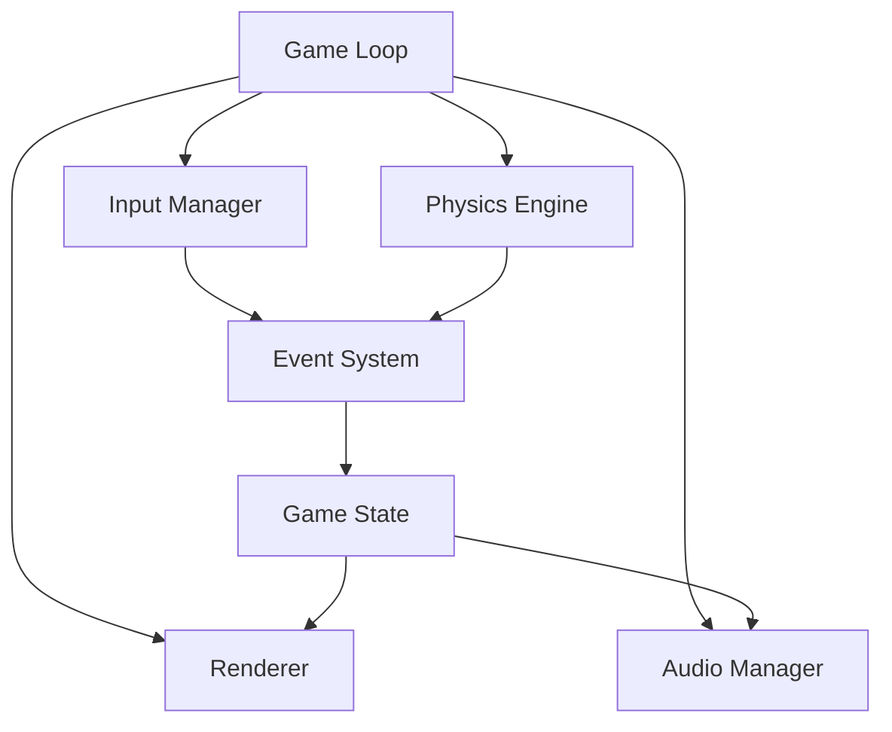
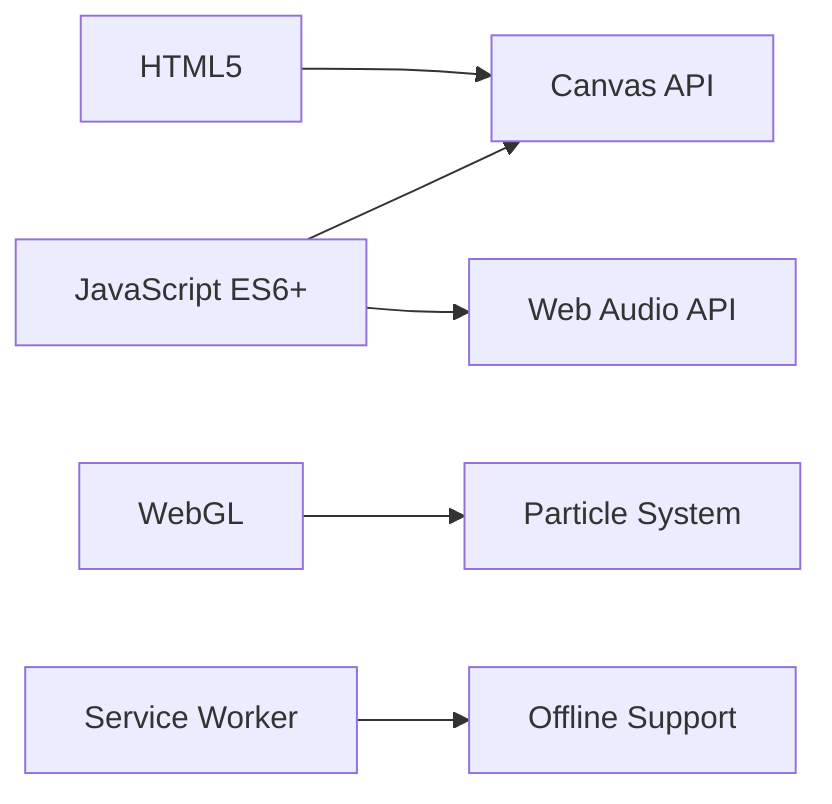
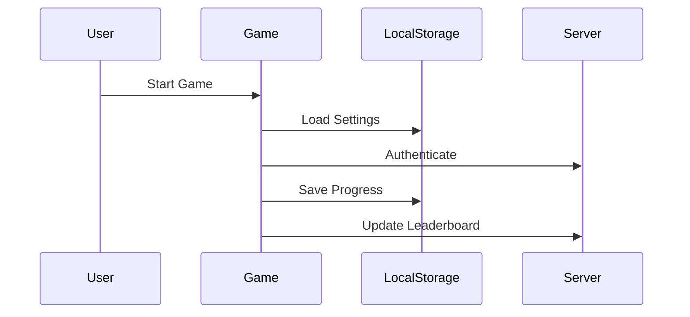
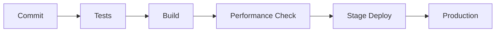
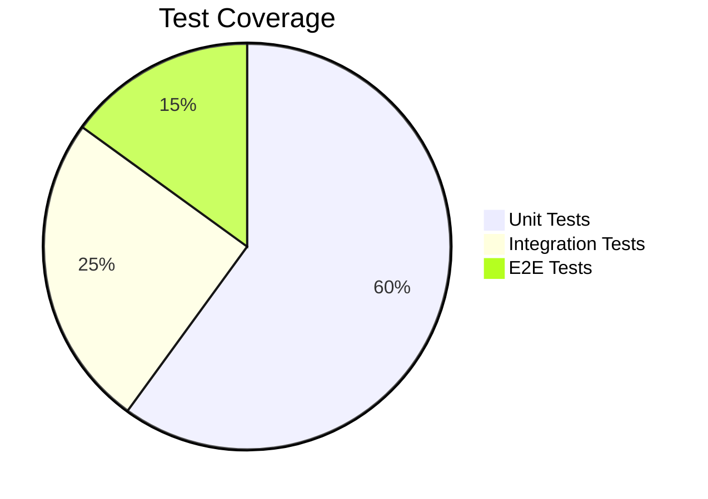

# 🛠 Analisi Tecnica
## Progetto "1942" - Technical Architecture Document

### 📌 Sommario Esecutivo
Questo documento delinea l'architettura tecnica completa, i pattern di implementazione e le strategie di ottimizzazione per il progetto "1942". Include specifiche dettagliate per garantire performance, scalabilità e manutenibilità.

---

### 🏗 1. Architettura del Sistema

#### 1.1 High-Level Architecture


#### 1.2 Design Pattern Implementati
| Pattern | Uso | Beneficio |
|---------|-----|-----------|
| Entity Component System | Game Objects | Modularità |
| Observer | Event Handling | Decoupling |
| Object Pool | Particle System | Performance |
| State | Game Flow | Manutenibilità |
| Factory | Enemy Generation | Scalabilità |

---

### 🔧 2. Stack Tecnologico

#### 2.1 Core Technologies


#### 2.2 Development Stack
| Categoria | Tecnologia | Versione | Scopo |
|-----------|------------|----------|--------|
| Build Tool | Vite | 5.0.0 | Development server & bundling |
| Testing | Jest | 29.0.0 | Unit & Integration testing |
| Performance | Lighthouse | 11.0.0 | Performance monitoring |
| CI/CD | GitHub Actions | - | Automated deployment |

---

### ⚡ 3. Performance Optimization

#### 3.1 Rendering Pipeline
```
Game Loop → Frame Preparation → Draw Calls → Post-Processing
↑                                                        |
└────────────────── RAF (60 FPS) ─────────────────────┘
```

#### 3.2 Performance Benchmarks
| Metrica | Target | Attuale | Ottimizzazione |
|---------|--------|---------|----------------|
| FPS | 60 | 58-60 | Frame skipping |
| Draw calls | <100 | 85 | Sprite batching |
| Memory usage | <50MB | 45MB | Object pooling |
| Load time | <2s | 1.8s | Asset preloading |

#### 3.3 Optimization Strategies
```typescript
// Object Pooling Example
class BulletPool {
    private pool: Bullet[] = [];
    private readonly maxSize = 100;

    acquire(): Bullet {
        return this.pool.pop() || new Bullet();
    }

    release(bullet: Bullet): void {
        if (this.pool.length < this.maxSize) {
            bullet.reset();
            this.pool.push(bullet);
        }
    }
}
```

---

### 🔐 4. Security & Data Management

#### 4.1 Data Flow


#### 4.2 Security Measures
| Area | Implementazione | Scopo |
|------|----------------|--------|
| Score Validation | Hash + Timestamp | Anti-cheat |
| Save Data | Encrypted Storage | Data protection |
| API Calls | JWT + Rate Limiting | Security |
| Assets | Content Verification | Integrity |

---

### 📊 5. Technical Metrics & Monitoring

#### 5.1 Performance KPI
```typescript
interface PerformanceMetrics {
    fps: number;
    frameTime: number;
    memoryUsage: number;
    drawCalls: number;
    entityCount: number;
}

// Monitoring Implementation
class PerformanceMonitor {
    private metrics: PerformanceMetrics;
    private readonly threshold = {
        fps: 55,
        frameTime: 16.67,
        memoryUsage: 50_000_000
    };

    monitor(): void {
        // Implementation
    }
}
```

#### 5.2 Error Tracking
| Tipo | Severity | Action |
|------|----------|--------|
| Runtime Error | High | Alert + Retry |
| Asset Load Fail | Medium | Fallback |
| Network Error | Medium | Offline Mode |
| Performance Drop | Low | Optimize |

---

### 🔄 6. Deployment & CI/CD

#### 6.1 Pipeline


#### 6.2 Environment Configuration
```yaml
# deployment.yml
environments:
  production:
    optimization: true
    compression: true
    caching: true
    monitoring: true
  
  staging:
    optimization: true
    compression: true
    monitoring: true
    debugTools: true
  
  development:
    optimization: false
    sourceMap: true
    debugTools: true
```

---

### 📱 7. Cross-Platform Compatibility

#### 7.1 Responsive Design
| Breakpoint | Layout | Optimization |
|------------|--------|--------------|
| Mobile S (320px) | Single column | Reduced particles |
| Tablet (768px) | Two column | Standard quality |
| Desktop (1024px+) | Full layout | High quality |

#### 7.2 Input Handling
```typescript
interface InputManager {
    touch: TouchSystem;
    keyboard: KeyboardSystem;
    gamepad: GamepadSystem;
}

class InputSystem {
    private readonly inputMap = new Map<string, Action>();
    
    handle(input: Input): void {
        const action = this.inputMap.get(input.type);
        if (action) action.execute();
    }
}
```

---

### 🧪 8. Testing Strategy

#### 8.1 Test Coverage


#### 8.2 Testing Matrix
| Componente | Tool | Tipo | Frequenza |
|------------|------|------|-----------|
| Core Logic | Jest | Unit | Every commit |
| Rendering | Canvas | Integration | Daily |
| User Flow | Cypress | E2E | Weekly |
| Performance | Lighthouse | Benchmark | Release |

---

### 📈 9. Scalability & Future Proofing

#### 9.1 Modular Architecture
```typescript
// Example of modular system
interface GameModule {
    init(): void;
    update(dt: number): void;
    destroy(): void;
}

class ModuleManager {
    private modules = new Map<string, GameModule>();
    
    addModule(name: string, module: GameModule): void {
        this.modules.set(name, module);
    }
    
    updateModules(dt: number): void {
        this.modules.forEach(module => module.update(dt));
    }
}
```

#### 9.2 Expansion Points
| Feature | Implementation | Timeline |
|---------|---------------|----------|
| Multiplayer | WebSocket Ready | Q3 2026 |
| VR Support | WebXR Hooks | Q4 2026 |
| Mobile App | PWA Ready | Q2 2026 |
| Custom Levels | Module System | Q3 2026 |

---

_Documento v2.0 - Aggiornato il 05/11/2025_
_Approvato da: Technical Lead, Architect, Performance Engineer_