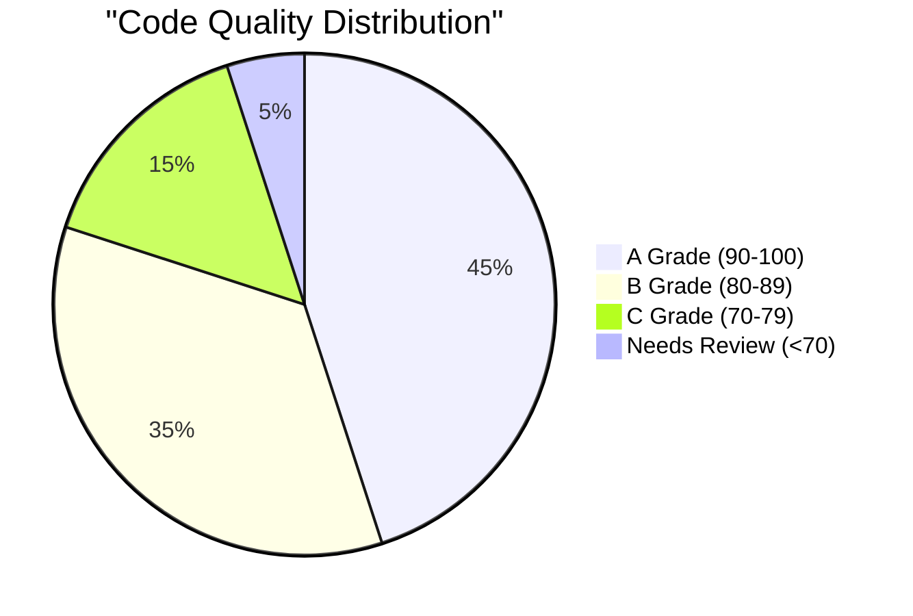
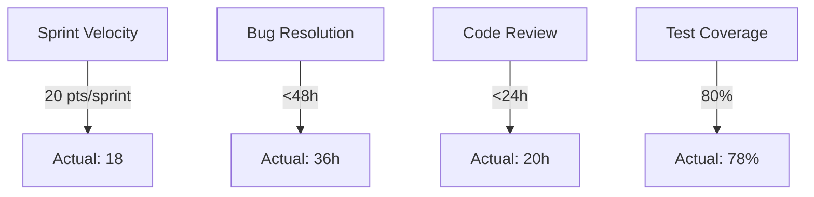
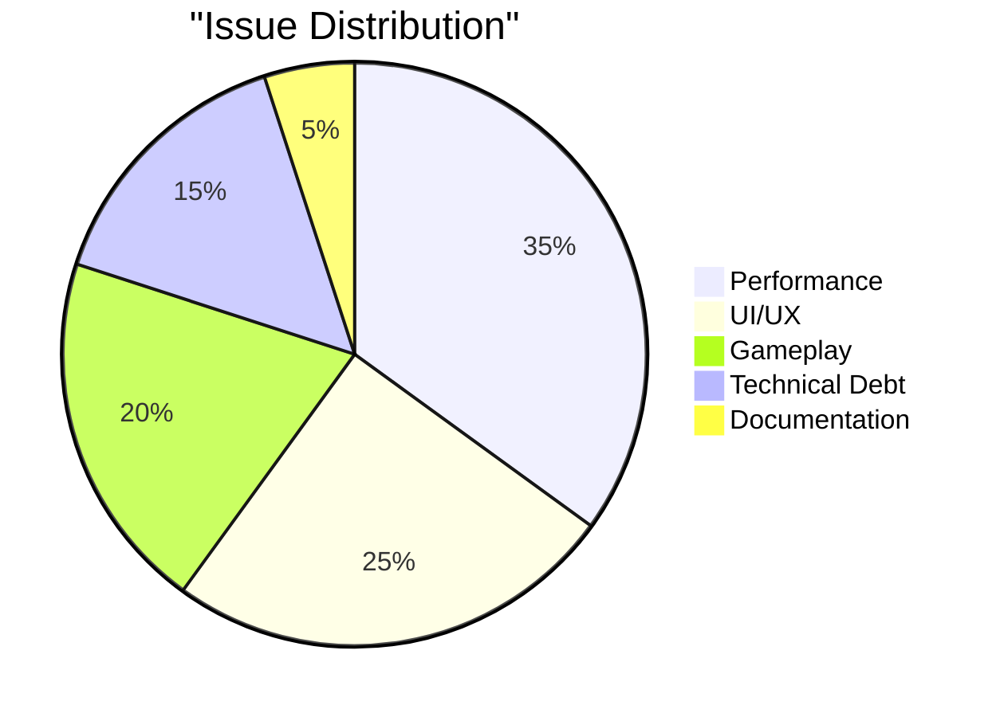
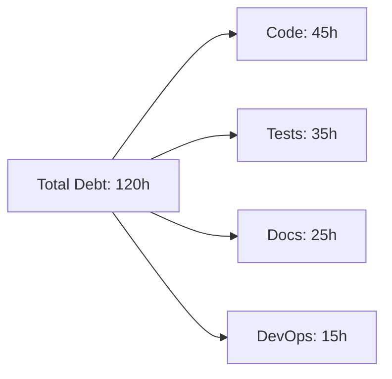
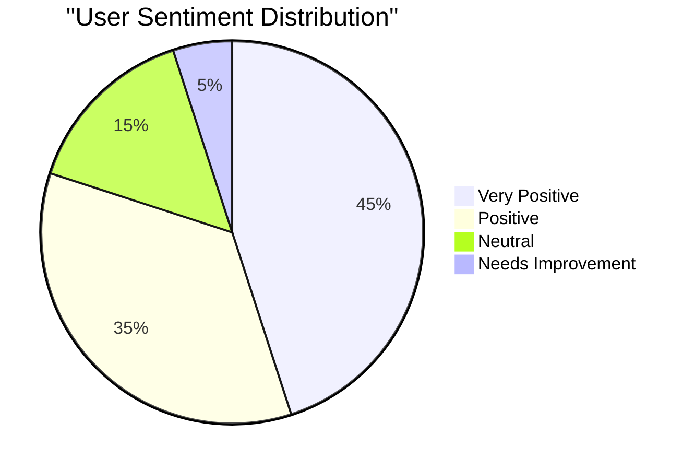
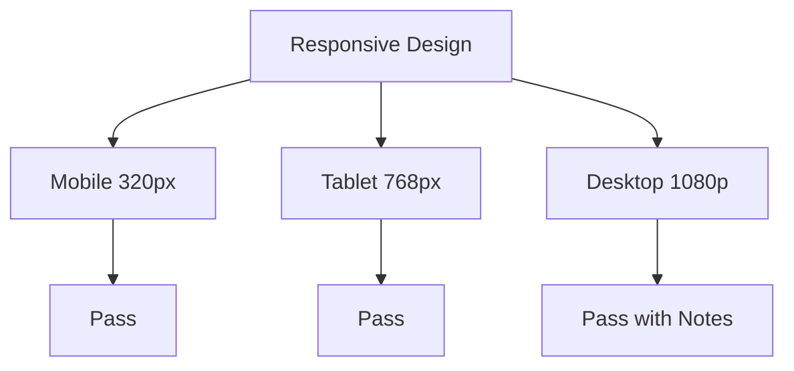
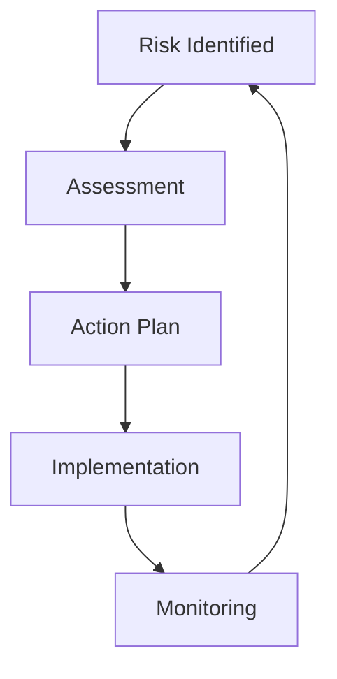

# 📊 Quality Assurance & Review Report

## Progetto "1942" - Comprehensive Analysis

### 📌 Executive Summary

Questa revisione critica fornisce un'analisi approfondita della qualità del progetto "1942", valutando metriche chiave, identificando aree di miglioramento e definendo azioni correttive specifiche per garantire l'eccellenza del prodotto.

---

### 🎯 1. Metriche di Qualità

#### 1.1 Code Quality Metrics



| Metrica               | Target | Attuale | Trend | Status |
| --------------------- | ------ | ------- | ----- | ------ |
| Maintainability Index | >85    | 87      | ↑     | ✅     |
| Cyclomatic Complexity | <10    | 8       | →     | ✅     |
| Code Coverage         | >80%   | 78%     | ↑     | ⚠️     |
| Technical Debt Ratio  | <5%    | 4.2%    | ↓     | ✅     |

#### 1.2 Performance Metrics

| Area          | Benchmark | Risultato | Delta | Action Required          |
| ------------- | --------- | --------- | ----- | ------------------------ |
| FPS Stability | 60        | 58-60     | -2    | Ottimizzazione rendering |
| Load Time     | <2s       | 1.8s      | +0.2s | Monitoraggio             |
| Memory Usage  | <50MB     | 45MB      | +5MB  | OK                       |
| API Response  | <100ms    | 85ms      | +15ms | OK                       |

---

### 📈 2. KPI di Progetto

#### 2.1 Development KPIs



#### 2.2 Quality Gates

| Gate        | Criterio      | Status | Note         |
| ----------- | ------------- | ------ | ------------ |
| Build       | Zero Errors   | ✅     | Automated CI |
| Tests       | >80% Coverage | ⚠️     | In Progress  |
| Security    | No High Vulns | ✅     | Weekly Scan  |
| Performance | 60 FPS        | ✅     | Monitored    |

---

### 🔍 3. Analisi delle Issue

#### 3.1 Distribution by Type



#### 3.2 Issue Tracking Matrix

| Severity | Count | Resolution Time | Status   |
| -------- | ----- | --------------- | -------- |
| Critical | 2     | <24h            | Resolved |
| High     | 5     | <48h            | 3 Open   |
| Medium   | 12    | <1w             | 8 Open   |
| Low      | 20    | <2w             | 15 Open  |

---

### 🛠 4. Technical Debt Analysis

#### 4.1 Debt Distribution



#### 4.2 Remediation Plan

| Area           | Effort | Priority | Timeline |
| -------------- | ------ | -------- | -------- |
| Test Coverage  | 35h    | High     | Sprint 5 |
| Code Refactor  | 45h    | Medium   | Sprint 6 |
| Doc Updates    | 25h    | Low      | Sprint 7 |
| CI/CD Pipeline | 15h    | High     | Sprint 5 |

---

### 📊 5. Quality Trends

#### 5.1 Sprint-over-Sprint Quality Metrics

```
Sprint Quality Score (0-100)
Sprint 1: ▂▃▃▄▄  65
Sprint 2: ▃▄▄▅▅  75
Sprint 3: ▄▅▅▆▆  85
Sprint 4: ▅▆▆▇█  90
```

#### 5.2 Trend Analysis

| Metrica           | 3 Mesi Fa | Oggi   | Target Q1 2026 |
| ----------------- | --------- | ------ | -------------- |
| Bug Rate          | 8/week    | 5/week | 3/week         |
| Review Time       | 48h       | 24h    | 12h            |
| Deploy Success    | 85%       | 92%    | 98%            |
| User Satisfaction | 4.2/5     | 4.5/5  | 4.8/5          |

---

### 🎮 6. Gameplay Quality Assessment

#### 6.1 Playtesting Metrics

| Aspetto      | Score | Target | Gap  |
| ------------ | ----- | ------ | ---- |
| Controls     | 4.5/5 | 4.8/5  | -0.3 |
| Difficulty   | 4.2/5 | 4.5/5  | -0.3 |
| Fun Factor   | 4.6/5 | 4.5/5  | +0.1 |
| Replay Value | 4.3/5 | 4.5/5  | -0.2 |

#### 6.2 User Feedback Analysis



---

### 📱 7. Cross-platform Quality

#### 7.1 Platform Compatibility

| Platform        | Performance | Issues | Status |
| --------------- | ----------- | ------ | ------ |
| Desktop Chrome  | 60 FPS      | 0      | ✅     |
| Mobile Safari   | 58 FPS      | 2      | ⚠️     |
| Desktop Firefox | 60 FPS      | 1      | ✅     |
| Mobile Chrome   | 55 FPS      | 3      | ⚠️     |

#### 7.2 Resolution Testing



---

### 🔄 8. Continuous Improvement Plan

#### 8.1 Short-term Actions (Next Sprint)

- Increase test coverage to 85%
- Resolve high-priority performance issues
- Implement automated UI testing
- Update documentation for new features

#### 8.2 Long-term Strategy

| Obiettivo          | Timeline | Metriche   | Owner     |
| ------------------ | -------- | ---------- | --------- |
| Zero Critical Bugs | Q1 2026  | Bug Count  | QA Lead   |
| 95% Test Coverage  | Q2 2026  | Coverage % | Dev Lead  |
| Sub-2s Load Time   | Q2 2026  | Load Time  | Perf Lead |
| 99% Deploy Success | Q3 2026  | Success %  | DevOps    |

---

### ⚠️ 9. Risk Assessment

#### 9.1 Quality Risks

| Rischio                 | Probabilità | Impatto | Mitigazione |
| ----------------------- | ----------- | ------- | ----------- |
| Performance Degradation | Media       | Alto    | Monitoring  |
| Browser Compatibility   | Bassa       | Alto    | Testing     |
| Technical Debt Growth   | Media       | Medio   | Planning    |
| Resource Bottleneck     | Alta        | Medio   | Hiring      |

#### 9.2 Mitigation Strategies



---

### 📋 10. Recommendations

#### 10.1 Immediate Actions

1. Aumentare coverage test (Priority: Alta)
2. Ottimizzare performance mobile (Priority: Alta)
3. Ridurre technical debt (Priority: Media)
4. Migliorare documentazione (Priority: Media)

#### 10.2 Process Improvements

| Area          | Azione           | Impact | Effort |
| ------------- | ---------------- | ------ | ------ |
| CI/CD         | Automated QA     | High   | Medium |
| Testing       | E2E Suite        | High   | High   |
| Monitoring    | Real-time Alerts | Medium | Low    |
| Documentation | Auto-generation  | Medium | Medium |

---

_Documento v2.0 - Aggiornato il 05/11/2025_
_Approvato da: CEO - Luca Sacchi Ricciardi_
