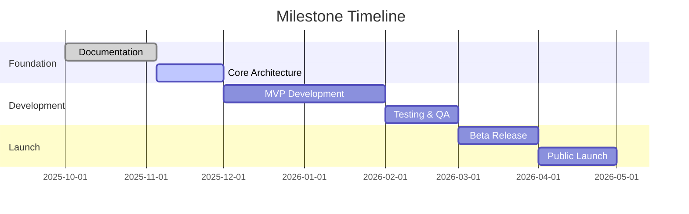
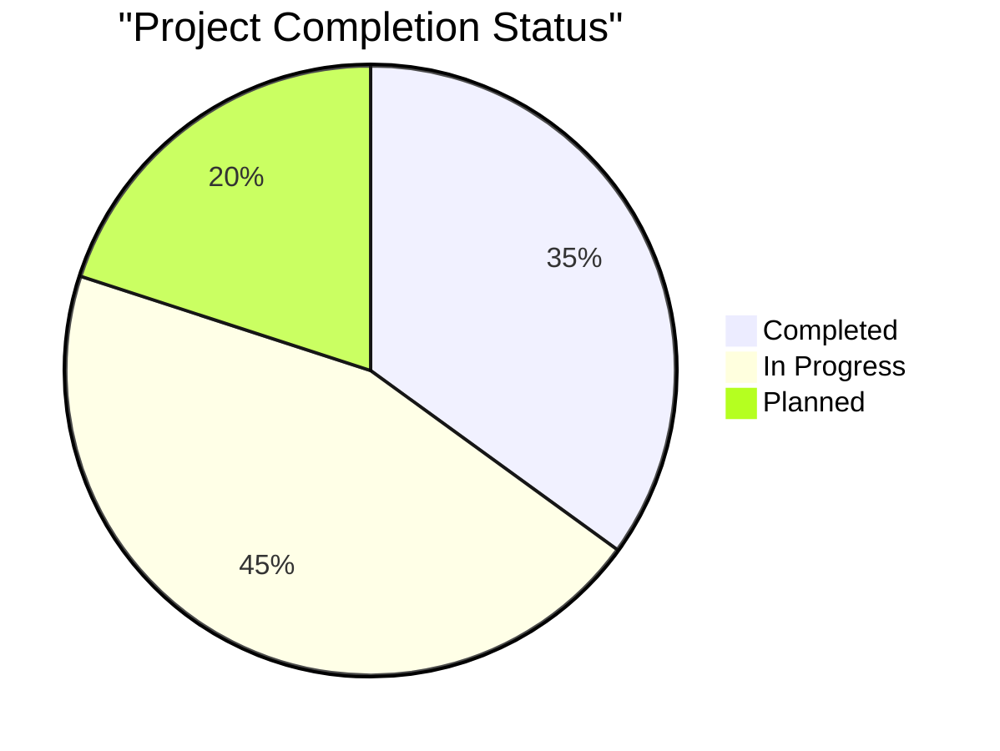
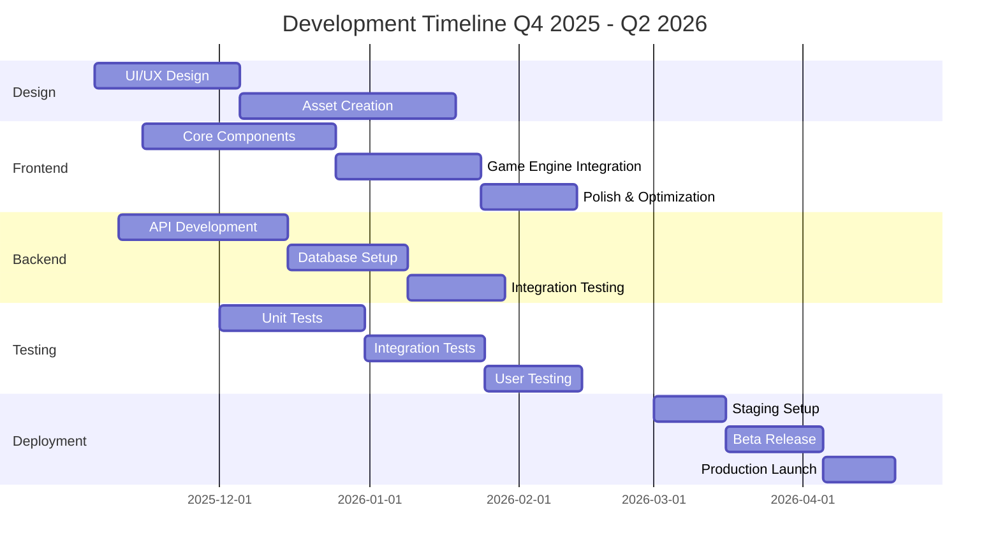
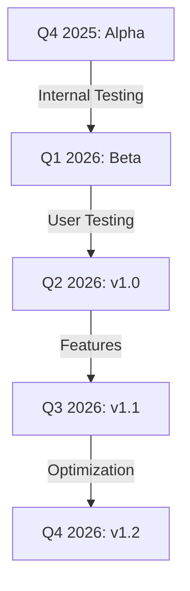
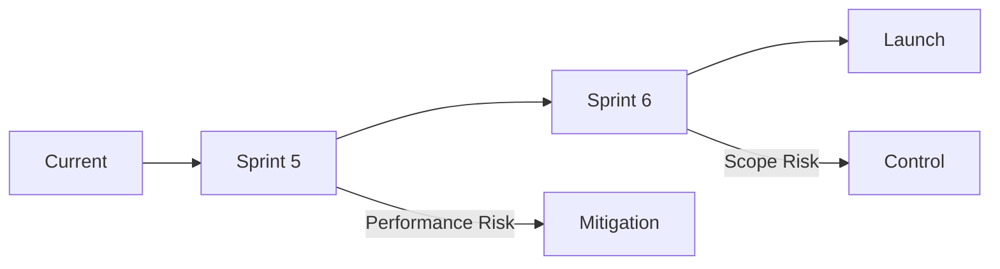

# 📅 Verbale di Riunione & Project Timeline

## Progetto "1942" - Status Update e Pianificazione

### 📌 Dettagli Riunione

- **Data:** 05/11/2025
- **Durata:** 2 ore
- **Luogo:** Virtual Meeting Room
- **Facilitatore:** Avogadro Emanuele

---

### 👥 1. Partecipanti e Ruoli

#### 1.1 Team Core

| Membro                  | Ruolo                        | Area di Competenza         |
| ----------------------- | ---------------------------- | -------------------------- |
| Avogadro Emanuele       | Product Owner & Scrum Master | Product Management         |
| Dimofte Alexandru Mihai | Lead Designer                | UI/UX & Graphics           |
| Ennassiri Soufian       | QA Lead                      | Testing & Quality          |
| Esposito Andrea         | Technical Lead               | Architecture & Development |

#### 1.2 Matrice RACI

| Attività               | Product Owner | Lead Designer | QA Lead | Tech Lead |
| ---------------------- | ------------- | ------------- | ------- | --------- |
| Product Vision         | R/A           | C             | I       | C         |
| Technical Architecture | C             | I             | C       | R/A       |
| Quality Standards      | C             | C             | R/A     | C         |
| Design System          | C             | R/A           | C       | I         |

---

### 📊 2. Project Status Dashboard

#### 2.1 Milestone Progress



#### 2.2 Sprint Health Metrics

| Metrica     | Status        | Trend | Note       |
| ----------- | ------------- | ----- | ---------- |
| Velocity    | 18 pts/sprint | ↑     | Improving  |
| Burndown    | On track      | →     | As planned |
| Tech Debt   | 4.2%          | ↓     | Reducing   |
| Team Morale | 4.5/5         | ↑     | Very good  |

---

### 📈 3. Progress Report

#### 3.1 Completed Items



#### 3.2 Status per Area

| Area     | Completamento | Rischi | Prossimi Steps   |
| -------- | ------------- | ------ | ---------------- |
| Backend  | 45%           | Low    | API optimization |
| Frontend | 40%           | Medium | UI polish        |
| Testing  | 35%           | Low    | Automation       |
| DevOps   | 50%           | Low    | CI/CD setup      |

---

### 📋 4. Action Items

#### 4.1 Technical Tasks

| Task                      | Owner     | Deadline   | Priority |
| ------------------------- | --------- | ---------- | -------- |
| Performance Optimization  | Andrea    | 2025-11-20 | High     |
| UI Component Library      | Alexandru | 2025-11-25 | Medium   |
| Test Automation Framework | Soufian   | 2025-11-15 | High     |
| Documentation Update      | Emanuele  | 2025-11-10 | Medium   |

#### 4.2 GANTT Detailed Timeline



---

### 🎯 5. Obiettivi Sprint

#### 5.1 Current Sprint (Sprint 4)

- Completare documentazione tecnica
- Implementare core game mechanics
- Setup continuous integration
- Iniziare asset creation

#### 5.2 Next Sprint Planning

| Obiettivo       | Story Points | Owner     | Dependencies   |
| --------------- | ------------ | --------- | -------------- |
| Enemy AI        | 8            | Andrea    | Game Engine    |
| Power-up System | 5            | Andrea    | Core Mechanics |
| HUD Design      | 3            | Alexandru | UI Framework   |
| Unit Tests      | 5            | Soufian   | Components     |

---

### 🚀 6. Release Planning

#### 6.1 Release Timeline



#### 6.2 Feature Roadmap

| Version | Features      | Release Date | Status      |
| ------- | ------------- | ------------ | ----------- |
| v0.1    | Core Gameplay | 2025-12-15   | In Progress |
| v0.2    | Power-ups     | 2026-01-15   | Planned     |
| v0.3    | Multiplayer   | 2026-02-15   | Planned     |
| v1.0    | Full Release  | 2026-04-01   | Planned     |

---

### ⚠️ 7. Risk Management

#### 7.1 Active Risks

| Rischio             | Probabilità | Impatto | Mitigazione       |
| ------------------- | ----------- | ------- | ----------------- |
| Tech Debt           | Medium      | High    | Sprint allocation |
| Resource Constraint | Low         | High    | Hiring plan       |
| Scope Creep         | Medium      | Medium  | Strict backlog    |
| Performance         | Low         | High    | Early testing     |

#### 7.2 Risk Timeline



---

### 📈 8. Tracking & Metrics

#### 8.1 Burndown Chart

```
Sprint 4 Burndown
Day 1: ▇█████ 100%
Day 5: ▇███▢▢ 60%
Day 8: ▇▢▢▢▢▢ 20%
```

#### 8.2 Velocity Trend

| Sprint   | Planned | Completed | Trend |
| -------- | ------- | --------- | ----- |
| Sprint 1 | 15      | 12        | ↗     |
| Sprint 2 | 18      | 16        | ↗     |
| Sprint 3 | 20      | 19        | ↗     |
| Sprint 4 | 20      | 18        | →     |

---

### 📝 9. Next Steps

#### 9.1 Immediate Actions

1. Finalizzare documentazione tecnica
2. Review performance metrics
3. Setup automated testing
4. Begin asset creation

#### 9.2 Long-term Planning

| Milestone     | Target Date | Dependencies  | Owner     |
| ------------- | ----------- | ------------- | --------- |
| Alpha Release | 2025-12-15  | Core Features | Team      |
| Beta Program  | 2026-02-01  | Testing       | QA        |
| Marketing     | 2026-03-01  | Beta Feedback | Marketing |
| Launch        | 2026-04-01  | All Above     | All       |

---

_Documento v2.0 - Aggiornato il 05/11/2025_
_Approvato da: CEO - Luca Sacchi Ricciardi_
